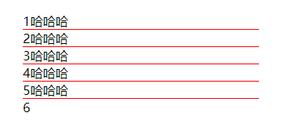

# 选择器

## 优先级

| 权重	   |  选择器      |  语法  |
| ------- | ----------- | ------- |
|  最高    | !important  |  `!important` |
|  1000   | 内联         |  `style="xx"` |
|  100    | ID          | `#from`  |
|  10     | 类           | `.btn`  |
|  10     | 属性         |  `[self]`、`[data-id="2"]` |
|  10     | 伪类         |  `:focus`、`:hover` |
|  1      | 伪元素       | `::before`、`::after`  |
|  1      | 标签         | `div`  |


## 属性选择器

### [name=value]
### [name~=value]
### [name^=value]
### [name$=value]
### [name*=value]
### [name|=value]

## 伪类选择器

### 1 :nth-of-type(n)   

选择第n个元素

```html
<div class="box">
    <p>1 永远相信美好的事情</p>
    <a>2 即将发生</a>
    <p>3 永远相信美好的事情</p>
    <p>4 永远相信美好的事情</p>
    <a>5 即将发生</a>
    <a>6 即将发生</a>
</div>
<style>
a:nth-of-type(2){ background: red; }    // 5
</style>
```

### 2 :last-of-type 

选择最后一个元素

```html
<div class="box">
    <p>1 永远相信美好的事情</p>
    <a>2 即将发生</a>
    <p>3 永远相信美好的事情</p>
    <p>4 永远相信美好的事情</p>
    <a>5 即将发生</a>
    <a>6 即将发生</a>
</div>
<style>
p:last-of-type{ background: red; }    // 4
</style>
```

### 3 :first-of-type   

选择第一个元素

```html
<div class="box">
    <p>1 永远相信美好的事情</p>
    <a>2 即将发生</a>
    <p>3 永远相信美好的事情</p>
    <p>4 永远相信美好的事情</p>
    <a>5 即将发生</a>
    <a>6 即将发生</a>
</div>
<style>
p:first-of-type{ background: red; }     // 1
a:first-of-type{ background: red; }     // 2
</style>
```

### 4 :nth-child(n)   

选择父元素的第n个子元素，第二个子元素必须为 a ，否则无效

```html
<div class="box">
    <p>1 永远相信美好的事情</p>
    <a>2 即将发生</a>
    <p>3 永远相信美好的事情</p>
    <p>4 永远相信美好的事情</p>
    <a>5 即将发生</a>
    <a>6 即将发生</a>
</div>
<style>
a:nth-child(2){ background: red; }  // 2
a:nth-child(3){ background: red; }  // xx
</style>
```

### 5 :nth-last-child(n)   

选择父元素的倒数第n个子元素，倒数第二个必须为 a ，否则无效

```html
<div class="box">
    <p>1 永远相信美好的事情</p>
    <a>2 即将发生</a>
    <p>3 永远相信美好的事情</p>
    <p>4 永远相信美好的事情</p>
    <a>5 即将发生</a>
    <a>6 即将发生</a>
</div>
<style>
a:nth-last-child(3){ background: red; } // xx
a:nth-last-child(2){ background: red; } // 5
</style>
```

### 6 :nth-last-of-type(n)   

选择倒数的第n个元素，选择倒数的第2个p元素，更实用

```html
<div class="box">
    <p>1 永远相信美好的事情</p>
    <a>2 即将发生</a>
    <p>3 永远相信美好的事情</p>
    <p>4 永远相信美好的事情</p>
    <a>5 即将发生</a>
    <a>6 即将发生</a>
</div>
<style>
p:nth-last-of-type(2){ background: red; }    // 3
a:nth-last-of-type(2){ background: red; }    // 5
</style>
```

### 7 :last-child   

选择最后一个元素

选择p元素的 父元素的 最后一个子元素，如果最后一个子元素不为 p ，则无效

```html
<div class="box">
    <p>1 永远相信美好的事情</p>
    <a>2 即将发生</a>
    <p>3 永远相信美好</p>
</div>
<div class="box">
    <a>4 永远相信美好的事情</a>
    <p>5 即将发生</p>
    <a>6 永远相信美好</a>
</div>
<div class="box">
    <p>7 永远相信美好的事情</p>
    <p>8 即将发生</p>
    <p>9 永远相信美好</p>
</div>
<style>
p:last-child{ background: red; }    // 3 9
</style>
```

### 8 :first-child   

选择第一个元素，与`:last-child`相对

```html
<div class="box">
    <p>1 永远相信美好的事情</p>
    <a>2 即将发生</a>
    <p>3 永远相信美好</p>
</div>
<div class="box">
    <a>4 永远相信美好的事情</a>
    <p>5 即将发生</p>
    <a>6 永远相信美好</a>
</div>
<div class="box">
    <p>7 永远相信美好的事情</p>
    <p>8 即将发生</p>
    <p>9 永远相信美好</p>
</div>
<style>
p:last-child{ background: red; }    // 1 7
</style>
```

### 9 :only-of-type   

选择父元素中仅有一个子元素的元素

选择 p 的父元素的子元素中仅有一个为 p 的元素

```html
<div>
    <p>1 永远相信美好的事情即将发生</p>
    <span>世界上没有什么事情比学习更重要</span>
</div>
<div>
    <p>加油</p>
    <p>努力</p>
    <p>奋斗</p>
</div>
<div>
    <span>世界上没有什么事情比学习更重要</span>
    <p>2 永远相信美好的事情即将发生</p>
</div>w
<style>
p:only-of-type{ background: red; }    // 1 2
</style>
```

### 10 :only-child   

选择父元素中唯一一个子元素的元素

选择 p 的父元素的唯一一个子元素并且为 p 的元素

```html
<div>
    <p>1 永远相信美好的事情即将发生</p>
    <span>世界上没有什么事情比学习更重要</span>
</div>
<div>
    <p>加油</p>
    <p>努力</p>
    <p>奋斗</p>
</div>
<div>
    <p>2 永远相信美好的事情即将发生</p>
</div>
<style>
p:only-child{ background: red; } /* 2 */
</style>
```

### 11 :not(selector)   

选择selector以外的元素

```html
<ul>
    <li>123123</li>
    <li>123123</li>
    <p>pppppppp</p>
    <li>123123</li>
    <li>123123</li>
    <p>pppppppp</p>
    <div>divdiv</div>
    <li>123123</li>
</ul>
<style>
ul:not(li){ color: red; }   /* p, div */
</style>
```

更常用的场景，给列表最后一个元素以外的`item`添加边框、伪元素。

```html
<ul>
    <li>1</li>
    <li>2</li>
    <li>3</li>
    <li>4</li>
    <li>5</li>
    <li>6</li>
</ul>
<style>
    ul li{
        list-style: none;
    }
    ul li:not(:last-child){
        border-bottom: 1px solid red;
    }
    ul li:not(:last-child):after{
        content: '哈哈哈';
    }
</style>
```



### 12 :first-letter 

选择元素的第一字母/字符（只对块级元素生效）

```html
<p>永远相信美好的事情即将发生</p>
<span>世界上没有什么事情比学习更重要</span>
<p>加油</p>
<p>努力</p>
<p>奋斗</p>
<p>wsydxiangwang</p>
<style>
p:first-letter{ font-size: 40px; background: red; }   /* 永 加 努 奋 W */
</style>
```

### 13 奇偶数

```html
<ul>
    <li>1 永远相信美好的事情即将发生</li>
    <li>2 永远相信美好的事情即将发生</li>
    <li>3 永远相信美好的事情即将发生</li>
    <li>4 永远相信美好的事情即将发生</li>
    <li>5 永远相信美好的事情即将发生</li>
    <li>6 永远相信美好的事情即将发生</li>
</ul>
<style>
li:nth-child(odd){ background: red; }       /* 1 3 5 */
li:nth-child(2n-1){ background: red; }      /* 1 3 5 */

li:nth-child(even){ background: green; }    /* 2 4 6 */
li:nth-child(2n){ background: green; }      /* 2 4 6 */
</style>
```
